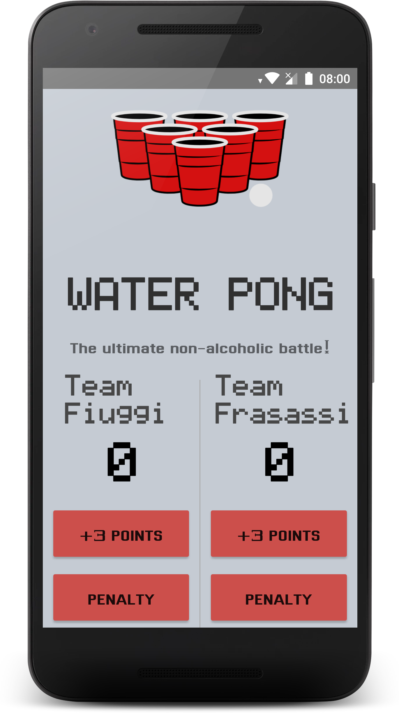

# WaterPong
The goal of this project is to create a Score Keeper app which gives a user the ability to keep track of the score of two different teams playing a game of your choice.
I've chosen the Water Pong counter, it’s a alchool free variant to the classical beer pong.

### Design Requirements
* App is divided into two columns, one for each team.
* Each column contains a large TextView to keep track of the current score for that team.
* Each column contains multiple buttons.
* The layout contains a ‘reset’ button.

### Test
* Run on Xiaomi Mi A1 (Android 8.1.0, API 27)
